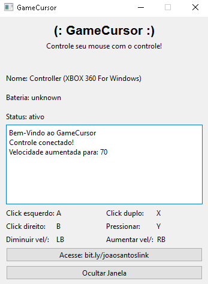

## GameCursor




### Sobre o projeto

O projeto GameCursor criado por <a href="https://github.com/Fulanodtals">Fulanodtals</a> possibilita que voce controle e execute ações com o mouse apartir de um controle de videogame, veja mais sobre o projeto <a href="#sumario">aqui</a> 
### Ajustes e melhorias

O projeto ainda está em desenvolvimento e as próximas atualizações serão voltadas para as seguintes tarefas:

- [x] criar conexao com o controle
- [x] criar arquivo para guardar valores
- [x] criar janela de gerenciamento
- [ ] opcao de modificar teclas na janela
- [ ] outras utilidades...

<p id='sumario'></p> <!gambiarra para linkar->

## Sumário da documentação

Aqui esta linkado as partes do projeto que deseja ver:
<div>
    <li><a href="#">Controller</a></li>
    <li><a href="#">Settings</a></li>
    <li><a href="#">Main</a></li>
    <li><a href="#">Buttons</a></li>
</div><br>


##  Informações iniciais

O GameCursor é feito usando POO, e sendo separado por tres arquivos:
main.py - Arquivo principal onde tem a janela do programa
controller.py - Classe que gerecia as ações do controle
settings.py - Classe que interaje com o arquivo config.txt
buttons.py - Arquivo que é usado para testar as teclas do controle.

## Controller

<p id='instalacao'></p> <!gambiarra para linkar->

## ☕ Usando <nome_do_projeto>

Para usar <nome_do_projeto>, siga estas etapas:

```
<exemplo_de_uso>
```

Adicione comandos de execução e exemplos que você acha que os usuários acharão úteis. Forneça uma referência de opções para pontos de bônus!

## 📫 Contribuindo para <nome_do_projeto>

Para contribuir com <nome_do_projeto>, siga estas etapas:

1. Bifurque este repositório.
2. Crie um branch: `git checkout -b <nome_branch>`.
3. Faça suas alterações e confirme-as: `git commit -m '<mensagem_commit>'`
4. Envie para o branch original: `git push origin <nome_do_projeto> / <local>`
5. Crie a solicitação de pull.

Como alternativa, consulte a documentação do GitHub em [como criar uma solicitação pull](https://help.github.com/en/github/collaborating-with-issues-and-pull-requests/creating-a-pull-request).

## 🤝 Colaboradores

Agradecemos às seguintes pessoas que contribuíram para este projeto:

<table>
  <tr>
    <td align="center">
      <a href="#" title="defina o título do link">
        <br>
        <sub>
          <b>Iuri Silva</b>
        </sub>
      </a>
    </td>
    <td align="center">
      <a href="#" title="defina o título do link">
        <br>
        <sub>
          <b>Mark Zuckerberg</b>
        </sub>
      </a>
    </td>
    <td align="center">
      <a href="#" title="defina o título do link">
        <br>
        <sub>
          <b>Steve Jobs</b>
        </sub>
      </a>
    </td>
  </tr>
</table>

## 😄 Seja um dos contribuidores

Quer fazer parte desse projeto? Clique [AQUI](CONTRIBUTING.md) e leia como contribuir.

## 📝 Licença

Esse projeto está sob licença. Veja o arquivo [LICENÇA](LICENSE.md) para mais detalhes.

https://github.com/iuricode/readme-template/blob/main/repositorio/exemplo-01.md