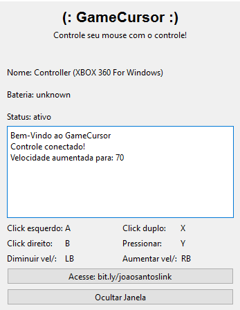
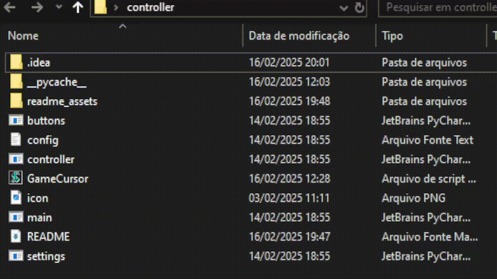
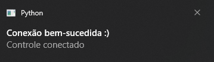

<div id='home'/>

# GameCursor


### Sobre o projeto

O projeto GameCursor criado por [Fulanodtals](https://github.com/Fulanodtals) possibilita que você controle e 
execute ações com o mouse apartir de um controle, como click, dubble click, click direito, arrastar, selecionar, 
Veja mais sobre o projeto [aqui](#sumario)



### Ajustes e melhorias

O projeto ainda está em desenvolvimento e as próximas atualizações serão voltadas para as seguintes tarefas:

- [x] criar conexao com o controle
- [x] criar arquivo para guardar valores
- [x] criar janela de gerenciamento
- [ ] suavilizar a movimentacao do mouse
- [ ] opcao de modificar teclas na janela
- [ ] otimizar
- [ ] outras utilidades...


<div id='sumario'/>

*******
## Sumário da documentação

Aqui esta linkado as partes do projeto que deseja ver:

* **[Informações iniciais](#introducao)**
* **[Instalação](#instalacao)**
* **[Controller](#controller)**
* **[Settings](#settings)**
* **[Main](#main)**
* **[Arquivo.vbs](#arquivovbs)**
* **[Buttons](#buttons)**   
*******


<div id='introducao'/>

##  Informações iniciais

O GameCursor é organizado com POO, utilizando bibliotecas como pygame, pyautogui e PyQt6.<br> 
Sendo separado por tres arquivos principais:
* main.py - Arquivo principal onde tem a janela do programa
* controller.py - Classe que gerencia as ações do controle
* settings.py - Classe que interage com o arquivo config.txt

E outros arquivos como:

* GameCursor.vbs - arquivo que inicia o programa
* settings.py - programa para testes de teclas

Os tres primeiros são os principais que controlam, configuram e gerenciam o programa;
Os outros dois podem ser usados também, principalmente o GameCursor.vbs mostrado na [Instalacao](#instalacao).

Quando o programa é iniciado(pelo arquivo main.py) é feita uma varredura de controles, ou seja, o programa so
ira iniciar realmente quando um controle for conectado; se o controle for desconectado, o programa devera ser
reiniciado!

> ATENCAO:<br>
> A varredura de controle é feita a cada 10s

Abaixo esta um exemplo de ação com o mouse, usando o GameCursor




<div id='instalacao'/>

## Instalação
Você de principio pode dar um git clone neste repositorio para uma pasta desejada:<br>
```bash
git clone https://github.com/Fulanodtals/GameCursor.git
```
Acessando a pasta, você pode excluir alguns arquivos, exceto os listados abaixo que são necessarios para o programa funcionar
e não devem ser deletados! São eles:

* main.py
* controller.py
* settings.py
* config.txt
* icon.png

E o arquivo de inicialização

* GameCursor.vbs

Os outros arquivos podem ser deletados.<br>
Para o programa funcionar você deve executar o arquivo main.py, e ha algumas possibilidades para facilitar que ele se
inicie, vou mostrar algumas delas:


### Por meio do arquivo .vbs
Você pode usar o **GameCursor.vbs** para executar o programa, apenas troque a parte <arquivo_main> pelo caminho do arquivo
main.py presente na pasta do projeto.

Apos isso ao executar o **GameCursor.vbs** ele ira iniciar o arquivo main.py, o que permite colocar este arquivo em varios lugares
como no Desktop, barra de tarefas e principalmente na pasta de inicializar:

Ao colocar o **GameCursor.vbs** na pasta de iniciar, o programa ira iniciar junto com o computador, segue como fazer isso:

Precione a tecla `win + r` e digite:
```shell
shell:startup
```
e por fim cole o arquivo **GameCursor.vps** na pasta e o programa ira iniciar assim que o computador for ligado

(delay provável de 30-60 segundos)

> IMPORTANTE! <br>
> O programa inicia uma busca por controles antes de ser executado totalmente;<br>
> para cancelar essa busca precione `Ctrl + Shift + Esc` e finalize a tarefa.

<br>

******

<div id='controller'/>
   
## Controller

O arquivo controller.py é responsavel por configrar o controle, conectar-lo e mostrar mensagens no computador,
ele é essencial para gerir as ações que você deseja fazer com o controle; suas funcões são:

   ### Função *messages()*:
Essa fução tem um unico objetivo de mostrar notificacão push do windows para informar o usuario, suas opções
estão listadas na função, um exemplo de notificacão esta abaixo:

</p> <!gambiarra para linkar->